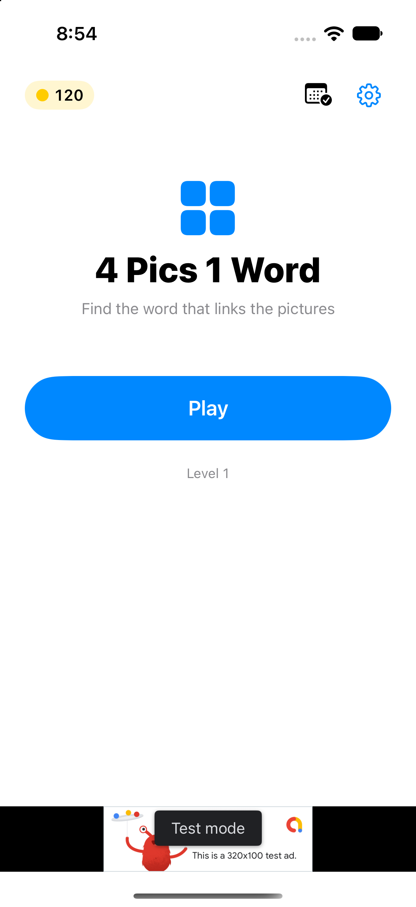
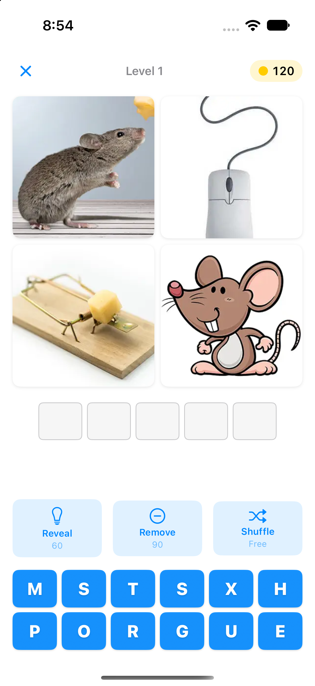
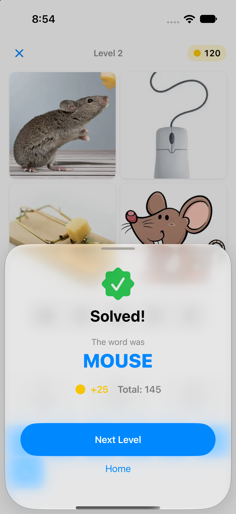
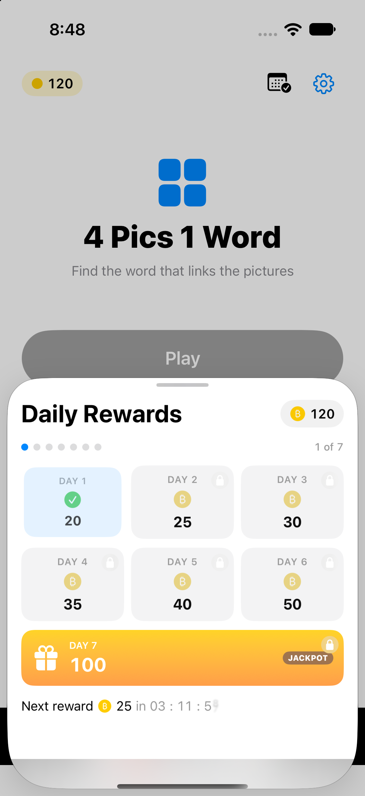

# 4 Pics 1 Word

**Find the word that links the pictures.** A complete, monetization-ready iOS word-puzzle game built in SwiftUI — not a demo, not a tutorial stub. Fork it, drop in your own puzzles, plug in your AdMob account, and you have a shippable app.

<p align="center">
  
  &nbsp;
  
  &nbsp;
  
  &nbsp;
  
</p>

<p align="center">
  
  
  
  
  
</p>

---

## Why this codebase

Most word-puzzle repos are half-finished exercises. This one is a **production-shaped game** where the hard, boring, and easy-to-get-wrong parts are already done:

- **The whole game loop works.** Four pictures, scrambled letter bank, answer slots, wrong-answer shake, solve celebration, seamless level wrap-around. No TODOs in the critical path.
- **The economy is wired.** Coins in (`25 + 5·tier` per solve, daily check-in streak `[20,25,30,35,40,50,100]` with a Day-7 jackpot), coins out (Reveal 60, Remove 90, Shuffle free). Engagement and retention hooks are built in, not bolted on.
- **Monetization is integrated, correctly.** AdMob banner, interstitial (every 3rd level-complete, ≥60s cooldown so you don't torch retention), and rewarded video (+50 coins) — behind an `AdsManaging` protocol so you can stub it in tests. UMP consent for EEA/UK and the ATT prompt flow are already implemented. This is the part most tutorials skip and most submissions get rejected for.
- **Content scales without code.** Puzzles are data (`puzzles.json` + `.webp` images, decoys seeded deterministically by `SplitMix64`). Adding a level means dropping files, not shipping an update.
- **The codebase is clean modern SwiftUI.** One `@Observable` model, declarative views, `MainActor` by default, file-system synchronized groups, 89 unit tests covering the game engine — easy to learn from, easy to extend.

## Turn it into revenue

1. **Clone & run** (5 min): `git clone`, open `4pics1word.xcodeproj`, build to a simulator. Done — the game plays.
2. **Make it yours** (the real work): your app name, icon, theme, puzzle content. Drop four `<puzzleId>_{1..4}.webp` images per level plus a `puzzles.json` entry — no code changes.
3. **Plug in money**: register an AdMob account, create ad units, swap the sample IDs in `Info.plist` (`GADApplicationIdentifier`) and `4pics1word/Ads/AdsConfiguration.swift`.
4. **Ship it**: screenshots, App Store listing, submit. The architecture doesn't change — only content and credentials.
5. **Grow**: more puzzles = more sessions. The streak/jackpot loop brings players back daily; interstitials monetize level transitions; rewarded ads monetize hint-hungry players.

Ideas for differentiation: themed puzzle packs, seasonal content, category modes, leaderboards, or a paid "no ads" tier — the codebase has room for all of it.

---

## What's inside

| System | Details |
|---|---|
| **Gameplay** | 4 pics → scrambled letter bank → answer slots; wrong-answer glow/shake; per-tile solve wave + haptics; tap-to-zoom images |
| **Economy** | `Economy`: starting 100 coins, solve `25 + 5·tier`, hints Reveal 60 / Remove 90 / Shuffle 0 |
| **Retention** | Daily check-in sheet — 7-day streak, Day-7 jackpot, live midnight countdown, coin-fly + confetti, clock-rewind protection |
| **Monetization** | Home banner; interstitial every 3rd win (60s cooldown); rewarded +50 coins from HomeView and insufficient-coins alert; ATT explainer after first solve; UMP consent |
| **Content pipeline** | `LevelService` + `PoolFactory` + `SplitMix64` — bundled `puzzles.json`/`strategy.json`, deterministic decoy letters, auto-filtered by bundled images |
| **UX polish** | Light/Dark toggle, haptics toggle, reset progress, reduce-motion / reduce-transparency / Dynamic Type gates |
| **Quality** | 89 unit tests (Swift Testing) driving `PuzzleState`/`AppModel`/`CheckIn` in isolation; XCTest UI suite; `-uitest-reset` launch arg |

## Architecture

A **single-`@Observable`-model + declarative view tree** — no VIPER scaffolding, no Combine, no dependency container. `AppModel` owns progress/settings/phase; `PuzzleState` owns one attempt's tile mechanics; views read them directly.

```text
SplashView (1.5s) → NavigationStack { HomeView }
                                       └─ settings / credits (push)
                     ├─ fullScreenCover → GameView  (phase ∈ playing/celebrating/won)
                     │      └─ sheet → WinView      (phase == .won)
                     └─ sheet(.medium) → CheckInView — daily reward; auto-fires once/day
```

Solve lifecycle:
```text
board full → PuzzleState.evaluate() → onSolved(state)
   → AppModel.handleSolved: reward + persist + advance + phase = .celebrating
   → celebration wave ends → phase = .won → WinView sheet
```

> Deeper detail: [`docs/system-architecture.md`](./docs/system-architecture.md) (Mermaid view+state tree), [`docs/codebase-summary.md`](./docs/codebase-summary.md) (file-by-file).

## Project structure

```text
4pics1word/
├── 4pics1word/
│   ├── _pics1wordApp.swift        # @main entry; hosts AppRootView; -uitest-reset hook
│   ├── Views/                     # AppRootView, HomeView, GameView, CheckInView, WinView, ATTExplainerView, …
│   ├── Components/                # LetterBank, PictureGrid, AnswerSlots, TileButton, …
│   ├── Game/                      # AppModel, PuzzleState, CheckIn, Economy, Feedback, Settings
│   ├── Ads/                       # AdsManager, AdsManaging, AdsConfiguration, ATTRequester, BannerHostView
│   ├── Data/                      # LevelService, Models, PoolFactory, ProgressStore, SplitMix64
│   ├── PrivacyInfo.xcprivacy      # Google SDK privacy manifest
│   └── Info.plist                 # GADApplicationIdentifier, SKAdNetworkItems
├── 4pics1wordTests/               # Swift Testing — unit
├── 4pics1wordUITests/             # XCTest — UI
├── docs/                          # architecture, roadmap, standards, deploy, screenshots
└── 4pics1word.xcodeproj
```

**Module-name gotcha:** the Swift module is `_pics1word`, not `4pics1word` (identifiers can't start with a digit). Tests import it as `@testable import _pics1word`. **File-system synchronized groups are on** — any `.swift` file dropped into the three source folders joins the target automatically; never hand-edit `project.pbxproj`.

## Setup

**Prerequisites:** Xcode 26.6+ (iOS 26.5 SDK). Open `4pics1word.xcodeproj` directly — no `.xcworkspace`. First build downloads `GoogleMobileAds` (+ `UserMessagingPlatform`) via SPM.

```bash
git clone https://github.com/dantech0xff/4pics1word.git
cd 4pics1word

# pick a simulator
xcrun simctl list devices available

# build
xcodebuild -project 4pics1word.xcodeproj -scheme 4pics1word \
  -destination 'platform=iOS Simulator,name=iPhone 16' build

# unit + UI tests
xcodebuild -project 4pics1word.xcodeproj -scheme 4pics1word \
  -destination 'platform=iOS Simulator,name=iPhone 16' test
```

- Single test: `test -only-testing:4pics1wordTests/CheckInTests`
- Signing is Automatic (bundled team `CTSG43U4D8`) — swap to yours for a physical device.
- Unit tests use **Swift Testing** (`import Testing`); UI tests use `XCTestCase`. Don't mix.

## Documentation

- [Project overview & PDR](./docs/project-overview-pdr.md)
- [System architecture](./docs/system-architecture.md)
- [Codebase summary](./docs/codebase-summary.md)
- [Code standards](./docs/code-standards.md)
- [Design guidelines](./docs/design-guidelines.md)
- [Deployment guide](./docs/deployment-guide.md)
- [Project roadmap](./docs/project-roadmap.md)

## Status

Active development — no CI/CD or Fastlane yet; all builds/tests run locally via `xcodebuild`. See the [roadmap](./docs/project-roadmap.md).

> ⚠️ **One thing stands between this repo and revenue: your AdMob account.** The app currently ships Google's sample/test ad-unit IDs — Apple rejects test ads and AdMob pays $0 on them. Register AdMob, create real ad units, and swap the IDs in `Info.plist` and `AdsConfiguration.swift`. That's it — no architecture change required.
