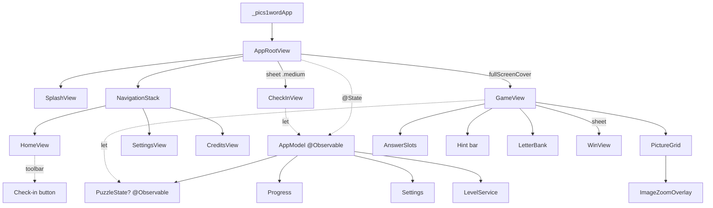

# System Architecture — 4 Pics 1 Word

SwiftUI app structure, state ownership, and data flow. Last updated: 2026-06-30.

## Navigation shell
`AppRootView` drives a sheet/cover-based flow (no `NavigationStack` for game):
```
SplashView (1.5s) → NavigationStack { HomeView }
                                       └─ Route.settings → SettingsView
                                       └─ Route.credits   → CreditsView
                     ├─ fullScreenCover → GameView (when phase ∈ {playing,celebrating,won})
                     │      └─ sheet → WinView (when phase == .won)
                     └─ sheet → CheckInView (.medium) — daily reward; auto-fires once/day
```
- `AppPhase` enum (`home`/`playing`/`celebrating`/`won`) is the single source for which layer is shown.
- Splash → Home transition: `withAnimation(.easeInOut(0.4))` after 1.5s sleep; check-in sheet auto-opens if `canCheckInToday && !hasSeenCheckinSheetToday`.

## State ownership
| Owner | Type | Role |
|---|---|---|
| `AppRootView` | `@State AppModel` | App-wide orchestrator (progress, settings, phase, active puzzle). |
| `GameView` | `let state: PuzzleState` | Per-puzzle attempt (tiles, bank, slots, coins, solve/reject tokens). |
| `CheckInView` | `let model: AppModel` | Reads/writes streak via `model.checkIn()`; ephemeral UI state local. |

- `AppModel` is `@Observable` — views observe mutations directly, no `@Published`/Combine.
- `PuzzleState` is `@Observable` and owned by `AppModel.gameState`; constructed per-level with an `onSolved` closure back to `AppModel`.

## Persistence
- `ProgressStore` (`UserDefaults` key `progress.v1`) ↔ `Progress` (level index, coins, solved IDs, streak, lifetime check-ins, anti-rewind `lastKnownNow`).
- `Settings` (`UserDefaults` key `settings.v1`) ↔ haptics, appearance, `lastCheckinSheetDay`.
- Saves are synchronous + immediate on every state change (solve, check-in, hint spend on exit) — no progress loss on interrupt.

## Key subsystems

### Daily check-in / streak (`CheckIn` + `AppModel.checkIn`)
- `rewards = [20,25,30,35,40,50,100]` indexed by `(streakDays-1) % 7`.
- `canClaim`: day delta ≠ 0 AND not clock-rewind-suspected (120s tolerance vs `lastKnownNow`).
- `nextStreakDay`: delta == 1 → `streakDays+1` (continues streak); else → 1 (reset).
- Claim path adds reward to coins, advances `lastKnownNow`, persists.

### Puzzle / level / pool (`LevelService` + `PoolFactory` + `SplitMix64`)
- `LevelService.load()` decodes `puzzles.json` + `strategy.json`, filters to puzzles with 4 bundled `.webp` images.
- Levels advance `(index+1) % totalLevels` — seamless loop, count never surfaced.
- `PoolFactory.makePool` seeds `SplitMix64(puzzle.id.stableSeed)` → deterministic decoys + shuffle per puzzle.
- `Strategy.tier(for: levelIndex)` from `rateLevels` thresholds → drives solve reward.

### Economy (`Economy` + `HintCost`)
- `startingCoins = 100`; solve reward `25 + 5*tier`; hint costs reveal 60 / remove 90 / shuffle 0.
- Solve reward applied by `AppModel.handleSolved` (not `PuzzleState`) — keeps puzzle engine free of tier/level knowledge.

### Feedback (`Feedback`)
- UIKit haptics only (no audio). Cached generators warmed via `prepareCelebration`. `enabled` mirrors settings.

## Solve lifecycle (cross-component)
```
board full → PuzzleState.evaluate() → onSolved(PuzzleState)
   → AppModel.handleSolved: reward + persist + advance index + phase = .celebrating
   → (safety-net Task scheduled, 2s)
GameView observes state.solvedToken → celebration wave (haptics per tile)
   → wave end → AppModel.completeSolve() → phase = .won → WinView sheet
```
Wrong path: `evaluate()` sets `isRejecting` + bumps `wrongAttemptToken` → `AnswerSlots` plays red glow/shake; `GameView` clears tiles via `clearWrongAttempt()` after 550ms (or immediately under reduce-motion).

## Diagram (view + state tree)


## Cross-references
- File-by-file detail: [codebase-summary.md](./codebase-summary.md).
- Conventions: [code-standards.md](./code-standards.md).
- UI patterns: [design-guidelines.md](./design-guidelines.md).
